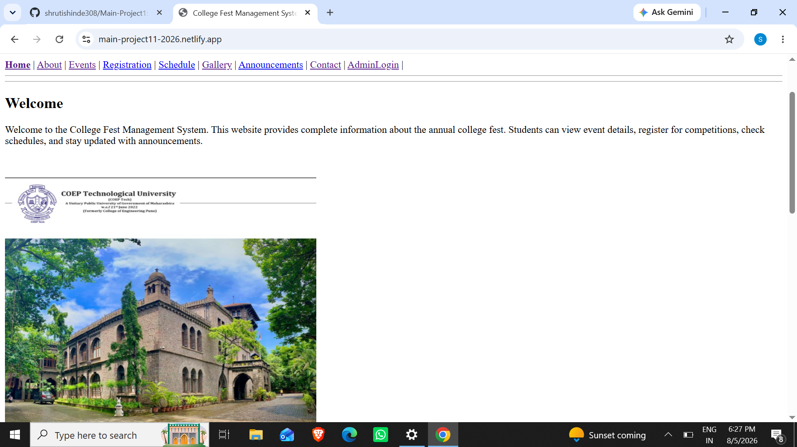
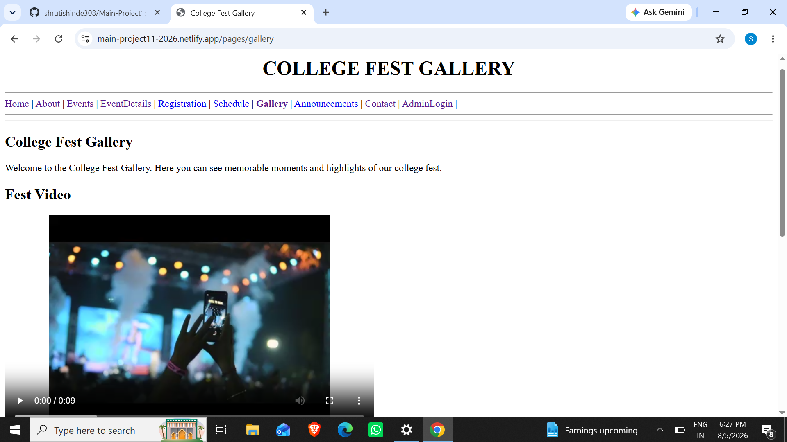
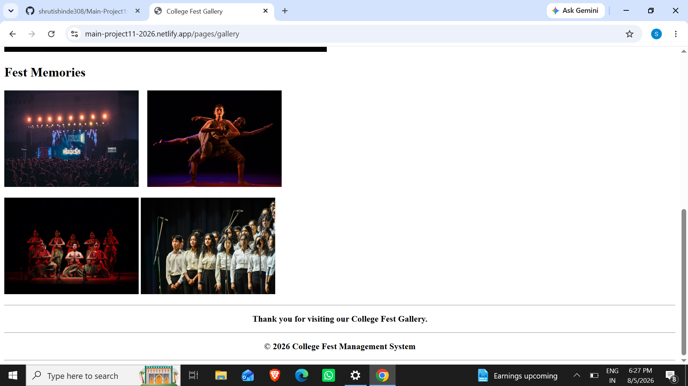

## Academic Project 
**Project Title:** College Fest Management System

# College Fest Management System

  

## Project Overview
The College Fest Management System is a simple web-based application developed using HTML5. It is designed to provide all the essential information about a college festival in one place. Students can easily explore different events, view event details, register for competitions, check schedules, browse the gallery, read announcements, and contact the organizing committee. This project demonstrates the basic concepts of web page development using only HTML.

## Objectives
- Provide complete information about the college fest.
- Display event details and schedules.
- Allow students to register for events.
- Share important announcements.
- Help students contact the organizing team.
- Demonstrate a simple HTML-based website.

## Features
- Home Page
- About Page
- Events Page
- Event Details Page
- Registration Form
- Schedule Page
- Gallery Page
- Announcements Page
- Contact Page
- Admin Login Page

## Technologies Used
- HTML5

## Conclusion
The College Fest Management System is a beginner-friendly academic project that demonstrates the fundamentals of web development using HTML. It provides an organized platform to manage and display college fest information. The project can be further enhanced by adding CSS, JavaScript, and database connectivity to create a complete dynamic web application.

## 📸 Project Screenshots

## 📸 Project Screenshots

### Home Page

### Gallery Page

### Gallery Page 2

Made with [contrib.rocks](https://contrib.rocks).